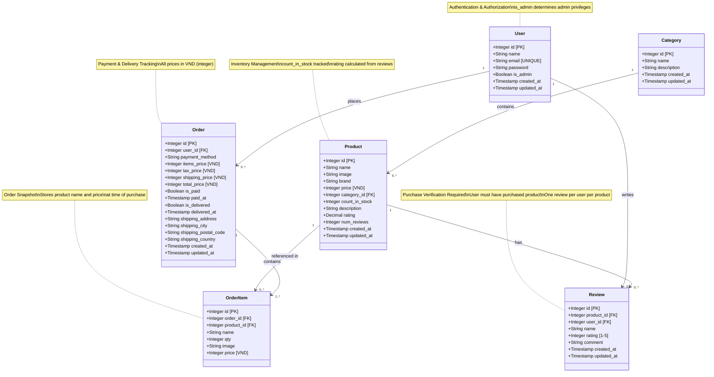

# Cake Store - UML Class Diagram

## Domain Model Overview

This diagram represents the database schema and relationships between domain entities in the Cake Store backend system.

## Entity Relationships

### 1. **User → Order** (One-to-Many)

- A user can place multiple orders
- Each order belongs to one user
- Business Rule: User must be authenticated to create orders

### 2. **User → Review** (One-to-Many)

- A user can write multiple reviews (for different products)
- Each review belongs to one user
- Business Rule: User can only review products they've purchased
- Constraint: One review per user per product (unique constraint)

### 3. **Category → Product** (One-to-Many)

- A category can contain multiple products
- Each product belongs to one category (optional)

### 4. **Product → Review** (One-to-Many)

- A product can have multiple reviews
- Each review is for one product
- Product's `rating` and `num_reviews` are automatically calculated from reviews

### 5. **Product → OrderItem** (One-to-Many)

- A product can appear in multiple order items
- Each order item references one product
- Order item stores a snapshot of product data at purchase time

### 6. **Order → OrderItem** (One-to-Many, Composition)

- An order must contain at least one order item
- Each order item belongs to exactly one order
- Cascade delete: Deleting an order deletes its order items

## Key Business Rules

### Authorization

- **is_admin** (User): Determines admin privileges for:
  - Managing products (create, update, delete)
  - Managing all orders (view, update, mark paid/delivered)
  - Deleting any review

### Orders

- **is_paid** (Order): Tracks payment status
  - Only paid orders count for review purchase verification
- **is_delivered** (Order): Tracks delivery status
- All prices stored as **integer VND** (Vietnamese Dong)
- Server-side price calculation (client prices ignored for security)

### Reviews

- **rating** (Review): Integer 1-5 (CHECK constraint)
- Users can only review products they've purchased (verified via paid orders)
- Unique constraint on (user_id, product_id)
- Only review owner can update (NOT admin)
- Review owner OR admin can delete

### Products

- **count_in_stock**: Automatically decremented when orders are placed
- **rating**: Calculated average from all reviews
- **num_reviews**: Count of reviews for the product
- **price**: Stored as integer VND

## Data Types Legend

| Type         | Description                                          | Example              |
| ------------ | ---------------------------------------------------- | -------------------- |
| Integer      | Whole number, used for IDs, quantities, prices (VND) | 100000 (100k VND)    |
| String       | Text data, varchar in DB                             | "Chocolate Cake"     |
| Boolean      | True/False flag                                      | true, false          |
| Decimal(3,1) | Decimal with 1 decimal place, range 0.0-5.0          | 4.5                  |
| Timestamp    | Date and time                                        | 2025-12-20T10:30:00Z |

## Notes

- **[PK]**: Primary Key
- **[FK]**: Foreign Key
- **[UNIQUE]**: Unique constraint
- **[VND]**: Vietnamese Dong currency (integer storage)
- All entities have `created_at` and `updated_at` timestamps (except OrderItem)
- Timestamps use ISO 8601 format with timezone

---

**Generated on:** December 20, 2025  
**Project:** Cake Store Website - Backend API  
**Database:** PostgreSQL (via Supabase)
