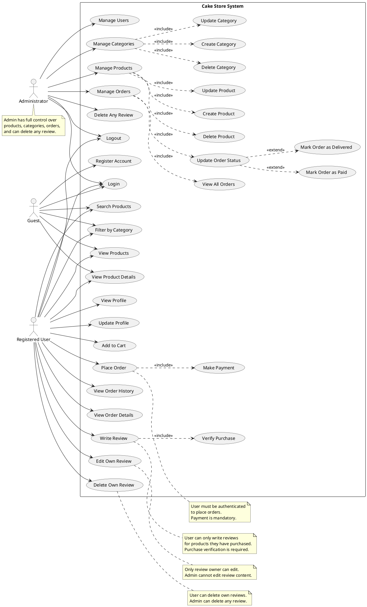

# Cake Store - UML Use Case Diagram

## Use Case Model Overview

This diagram represents the functional requirements and actor interactions in the Cake Store web application.

## PlantUML Diagram

## Actor Descriptions

### 1. **Guest** (Unauthenticated Visitor)

Anonymous users who visit the website without logging in.

**Capabilities:**

- Browse and view products
- View product details (name, price, description, reviews)
- Search and filter products by category
- Register for a new account
- Login to existing account

**Restrictions:**

- Cannot add items to cart
- Cannot place orders
- Cannot write or manage reviews

### 2. **Registered User** (Authenticated Customer)

Customers who have registered and logged into their account.

**Capabilities:**

- All Guest capabilities (browse, view, search)
- Profile management (view, update personal information)
- Shopping cart operations
- Order placement with payment
- View order history and details
- Write reviews for purchased products only
- Edit and delete their own reviews
- Logout

**Business Rules:**

- Must verify purchase before writing review
- Can only edit/delete own reviews
- One review per product per user

### 3. **Administrator** (System Admin)

System administrators who manage the platform.

**Capabilities:**

- Login/Logout
- **User Management**: View all users, lock/unlock accounts, delete users
- **Category Management**: Create, Read, Update, Delete categories
- **Product Management**: Create, Read, Update, Delete products (with images, pricing, stock)
- **Order Management**: View all orders, update delivery status, mark as paid/delivered
- **Review Moderation**: Delete any inappropriate review

**Restrictions:**

- Cannot edit review content (only delete)
- Cannot place orders as admin (should use customer account)

## Use Case Details

### Critical Use Cases

#### UC11: Place Order (User)

**Preconditions:**

- User must be authenticated
- Cart must contain at least one item
- Products must be in stock

**Main Flow:**

1. User adds products to cart
2. User proceeds to checkout
3. User enters shipping information
4. System calculates prices (items, tax, shipping)
5. System includes payment (UC12)
6. System creates order and order items
7. System updates product stock
8. System confirms order to user

**Postconditions:**

- Order created with `is_paid = false` initially
- Stock decremented
- User can view order in history

#### UC15: Write Review (User)

**Preconditions:**

- User must be authenticated
- User must have purchased the product (UC18)
- User hasn't already reviewed this product

**Main Flow:**

1. User navigates to purchased product
2. User clicks "Write Review"
3. System verifies purchase (UC18)
4. User enters rating (1-5) and comment
5. System saves review
6. System updates product rating and review count

**Postconditions:**

- Review created and visible to all users
- Product rating recalculated

#### UC18: Verify Purchase (System)

**Triggered by:** Write Review (UC15)

**Main Flow:**

1. System queries orders table
2. System checks for paid orders containing the product
3. System verifies user_id matches
4. System returns verification result

**Business Rule:**

- Only orders with `is_paid = true` count as purchases

#### UC28: Manage Orders (Admin)

**Preconditions:**

- Admin must be authenticated

**Main Flow:**

1. Admin views all orders (UC29)
2. Admin selects an order
3. Admin updates order status (UC30)
   - Can mark as paid (UC31)
   - Can mark as delivered (UC32)

**Postconditions:**

- Order status updated
- Timestamps recorded (paid_at, delivered_at)

## Relationship Types

### <<include>>

Mandatory sub-use cases that are always executed:

| Base Use Case     | Included Use Case             | Reason                                  |
| ----------------- | ----------------------------- | --------------------------------------- |
| Place Order       | Make Payment                  | Payment is mandatory for order creation |
| Write Review      | Verify Purchase               | Purchase verification is required       |
| Manage Categories | Create/Update/Delete Category | CRUD operations are part of management  |
| Manage Products   | Create/Update/Delete Product  | CRUD operations are part of management  |
| Manage Orders     | View All Orders               | Must view to manage                     |
| Manage Orders     | Update Order Status           | Core management function                |

### <<extend>>

Optional extensions that may occur:

| Base Use Case       | Extension Use Case | Condition                 |
| ------------------- | ------------------ | ------------------------- |
| Update Order Status | Mark as Paid       | When payment is confirmed |
| Update Order Status | Mark as Delivered  | When order is delivered   |

## Authentication & Authorization Rules

### Guest → User Transition

- **Register Account (UC5)**: Creates new user record
- **Login (UC6)**: Authenticates and creates JWT token

### Role-Based Access Control

| Use Case          | Guest | User                | Admin |
| ----------------- | ----- | ------------------- | ----- |
| View Products     | ✅    | ✅                  | ✅    |
| Place Order       | ❌    | ✅                  | ❌\*  |
| Write Review      | ❌    | ✅ (purchased only) | ❌    |
| Manage Products   | ❌    | ❌                  | ✅    |
| Delete Any Review | ❌    | ❌ (own only)       | ✅    |

\*Admin should use separate customer account for ordering

## System Boundaries

The **Cake Store System** includes:

- Product catalog and search
- User authentication and profile management
- Shopping cart (client-side or session-based)
- Order processing and payment
- Review and rating system
- Admin management interfaces

The system does **NOT** include:

- Payment gateway (external system)
- Email notifications (out of scope)
- Shipping/logistics tracking (external)

---

**Generated on:** December 20, 2025  
**Project:** Cake Store Website - Backend API  
**Diagram Type:** Use Case Diagram (PlantUML)
