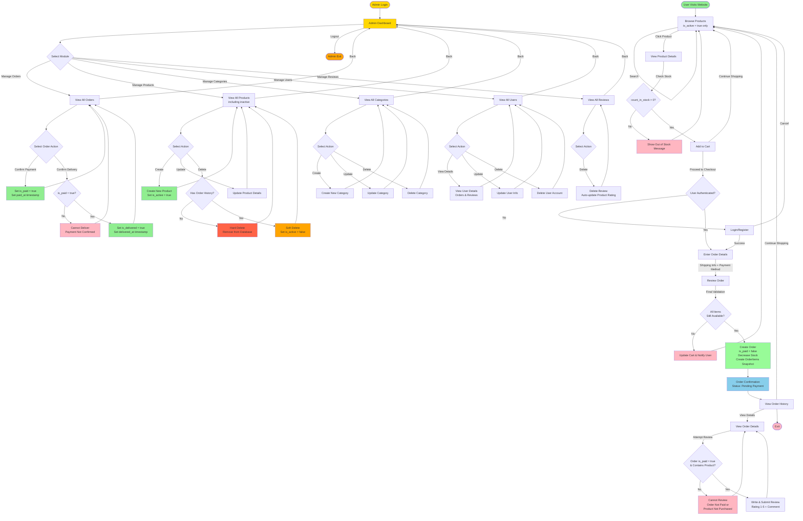

# Cake Store - User Flow Diagram

## E-Commerce Purchase Flow

This diagram illustrates the complete user journey from browsing products to viewing order history in the Cake Store system.

## Flow Description

### **Customer Flow**

#### 1. **Browse Products**

- **Actors**: Guest, Registered User
- User can view all products, filter by category, or search
- Products displayed with image, name, price, and rating
- **Important**: Only active products (`is_active=true`) are shown to customers
- Inactive products are completely hidden from customer view

#### 2. **View Product Details**

- **Actors**: Guest, Registered User
- Detailed product information including:
  - Description, brand, price (VND)
  - Stock availability (`count_in_stock`)
  - Customer reviews and ratings
  - Product images
- Stock check: Only products with `count_in_stock > 0` can be added to cart

#### 3. **Add to Cart**

- **Actors**: Guest, Registered User
- Stock validation before adding (must have stock available)
- User can continue shopping or proceed to checkout
- Cart persists during session (client-side or session storage)

#### 4. **Authentication Check**

- **Decision Point**: Is user authenticated?
- Guest users redirected to login/register page
- Registered users proceed directly to order placement
- Session maintained after authentication

#### 5. **Enter Order Details**

- **Actors**: Registered User only
- User enters shipping information:
  - Address, city, postal code, country
- User selects payment method:
  - **Cash** (Cash on Delivery)
  - **Bank Transfer** (Manual verification)
- Server-side price calculation:
  - Items price (sum of product prices × quantities)
  - Tax price (configurable rate)
  - Shipping price (free shipping threshold available)
  - Total price

#### 6. **Final Stock Validation**

- **Decision Point**: Are all items still available?
- Server validates stock for all cart items before creating order
- Prevents overselling due to race conditions
- If any item unavailable → update cart and notify user
- If all valid → proceed to create order

#### 7. **Create Order**

- **Critical Step**: Order creation with inventory update
- Order created with:
  - `is_paid = false` (Pending payment confirmation)
  - `is_delivered = false`
  - Selected payment method (Cash/Bank Transfer)
  - Shipping information
  - Calculated prices
- **OrderItems created** using snapshot pattern:
  - Product name, price, image copied at time of purchase
  - Preserves order history even if product changes later
- **Inventory decreased immediately**:
  - `count_in_stock` decremented for each product
  - Reserves stock even before payment confirmation

#### 8. **Order Confirmation**

- Confirmation page with order details
- Order ID for tracking
- Status: **Pending Payment**
- User notified to complete payment via selected method
- Order stored in database with all details

#### 9. **View Order History**

- **Actors**: Registered User
- User can view all their orders
- Order status displayed:
  - Payment status (`is_paid`)
  - Delivery status (`is_delivered`)
- Access to detailed order information
- Can click to view individual order details

#### 10. **Write Review**

- **Actors**: Registered User (authenticated)
- User attempts to write review from Order Details page
- **Critical Verification** (Server-side):
  1. Check if `order.is_paid = true` (Payment must be confirmed)
  2. Check if order contains the product being reviewed
  3. Check if user hasn't already reviewed this product
- **If verification fails**: Reject review with error message
- **If verification passes**: Allow user to submit review
  - Rating: 1-5 (integer, required)
  - Comment: Text (required)
- **Business Rule**: One review per user per product
- Product's `rating` and `num_reviews` auto-updated after review submission

### **Admin Flow**

#### 11. **Admin Authentication**

- **Actor**: Administrator only
- Admin must log in with admin credentials (`is_admin=true`)
- After successful login, redirected to Admin Dashboard
- All admin actions require authentication

#### 12. **Admin Dashboard**

- **Central Hub** for all administrative functions
- Admin can access five main management modules:
  1. **Manage Orders** - View and update order status
  2. **Manage Products** - CRUD operations on products
  3. **Manage Categories** - CRUD operations on categories
  4. **Manage Users** - View and manage user accounts
  5. **Manage Reviews** - View and delete reviews
- Admin can logout from dashboard

---

### **Admin Module: Manage Orders**

#### 13. **View All Orders**

- Admin can view all orders from all users
- Display order information:
  - Order ID, user, date, total price
  - Payment status (`is_paid`)
  - Delivery status (`is_delivered`)
- Filter/sort by status (paid/unpaid, delivered/undelivered)
- Access to full order details including:
  - Customer information
  - Shipping address
  - Order items with quantities
  - Payment method

#### 14. **Confirm Payment**

- **Admin Action**: Manual payment verification
- Admin verifies that customer has completed payment via:
  - Bank transfer confirmation (check bank statement)
  - Cash received on delivery
- Admin action:
  - Set `is_paid = true`
  - Set `paid_at = current timestamp`
- **Effect**:
  - Order now qualifies for review eligibility
  - Order can now be delivered
- Return to order list

#### 15. **Confirm Delivery**

- **Admin Action**: Manual delivery confirmation
- **Prerequisite Check**: Order must be paid (`is_paid=true`)
  - If not paid → deny delivery confirmation with error message
  - If paid → allow delivery confirmation
- Admin confirms that order has been delivered to customer
- Admin action:
  - Set `is_delivered = true`
  - Set `delivered_at = current timestamp`
- **Effect**: Order marked as completed
- Return to order list

---

### **Admin Module: Manage Products**

#### 16. **View All Products**

- Admin can view ALL products including:
  - Active products (`is_active=true`)
  - Inactive/soft-deleted products (`is_active=false`)
- Display product information:
  - ID, name, brand, price, stock, category
  - Active status
  - Rating and review count
- Filter by category, status (active/inactive), stock level

#### 17. **Create Product**

- **Admin Action**: Add new product to catalog
- Admin enters product details:
  - Name, brand, description
  - Price (VND, integer)
  - Category (FK to categories table)
  - Image URL
  - Initial stock count (`count_in_stock`)
- New product created with:
  - `is_active = true` (default)
  - `rating = 0`, `num_reviews = 0` (default)
- Return to product list

#### 18. **Update Product**

- **Admin Action**: Modify existing product details
- Admin can update:
  - Product information (name, brand, description, image)
  - Price (affects new orders only, not existing orders)
  - Category
  - Stock count (`count_in_stock`)
  - Active status (can reactivate soft-deleted products)
- **Note**: Price changes don't affect existing orders (snapshot pattern)
- Return to product list

#### 19. **Delete Product**

- **Admin Action**: Remove product from catalog
- **Critical Business Logic - Two Delete Strategies**:

  **Strategy 1: Hard Delete**

  - **Condition**: Product has NEVER been ordered (no order history)
  - **Action**: Permanently delete product from database
  - **SQL**: `DELETE FROM products WHERE id = ?`
  - **Effect**: Product completely removed, no trace in system

  **Strategy 2: Soft Delete**

  - **Condition**: Product HAS order history (exists in order_items table)
  - **Action**: Set `is_active = false`
  - **SQL**: `UPDATE products SET is_active = false WHERE id = ?`
  - **Effect**:
    - Product hidden from customer views
    - Product visible in admin panel (with inactive status)
    - Order history preserved (OrderItems still reference product)
    - Product can be reactivated if needed

- Return to product list

---

### **Admin Module: Manage Categories**

#### 20. **View All Categories**

- Admin can view all categories
- Display category information:
  - ID, name, description
  - Number of products in category
- Access to category details

#### 21. **Create Category**

- **Admin Action**: Add new product category
- Admin enters:
  - Category name
  - Description
- New category created
- Return to category list

#### 22. **Update Category**

- **Admin Action**: Modify category details
- Admin can update:
  - Category name
  - Description
- Changes reflected immediately
- Return to category list

#### 23. **Delete Category**

- **Admin Action**: Remove category
- Category deleted from database
- **Effect**: Products in this category have `category_id` set to NULL
- Return to category list

---

### **Admin Module: Manage Users**

#### 24. **View All Users**

- Admin can view all registered users
- Display user information:
  - ID, name, email
  - Admin status (`is_admin`)
  - Registration date
  - Order count, review count
- Filter by admin status

#### 25. **View User Details**

- **Admin Action**: View detailed user information
- Display:
  - User profile information
  - Order history (all user's orders)
  - Reviews written by user
  - Activity summary
- Return to user list

#### 26. **Update User**

- **Admin Action**: Modify user information
- Admin can update:
  - User name
  - Email
  - Admin privileges (`is_admin`)
  - Password (if requested)
- Return to user list

#### 27. **Delete User**

- **Admin Action**: Remove user account
- **Warning**: This affects:
  - User can no longer log in
  - User's orders remain in system (for record keeping)
  - User's reviews remain (attributed to deleted user)
- User account deleted
- Return to user list

---

### **Admin Module: Manage Reviews**

#### 28. **View All Reviews**

- Admin can view all product reviews
- Display review information:
  - Review ID, product name, user name
  - Rating (1-5)
  - Comment
  - Date posted
- Filter by product, rating, user

#### 29. **Delete Review**

- **Admin Action**: Remove inappropriate or spam reviews
- **Business Rule**: Admin can delete ANY review (unlike users who can only delete their own)
- Admin action:
  - Delete review from database
- **Auto-calculation triggered**:
  - Product's `rating` recalculated (average of remaining reviews)
  - Product's `num_reviews` decremented
- **Effect**: Product rating updated immediately
- Return to review list

---

### **Admin Logout**

#### 30. **Logout**

- Admin logs out from dashboard
- Session terminated
- Redirected to login page or home page

## Business Rules Applied

### **Product Visibility & Soft Delete**

- **Active Products Only**: Only products with `is_active=true` are visible to customers
- **Soft Delete Protection**: Inactive products (`is_active=false`) are hidden but preserve order history
- Admin can still view and manage inactive products

### **Authentication & Authorization**

- **Orders Require Authentication**: Only registered users can place orders
- **Guest Browsing Allowed**: Guests can browse and view products
- **Admin Privileges**: Admin has full access to manage all entities

### **Stock Management**

- **Immediate Stock Reservation**: `count_in_stock` decreased when order is created (not when paid)
- **Double Validation**: Stock checked before adding to cart AND before creating order
- **Prevents Overselling**: Final server-side validation prevents race conditions

### **Order & Payment Flow**

- **Manual Payment Verification**: No real-time payment gateway
- **Two Payment Methods**: Cash or Bank Transfer only
- **Order Created Unpaid**: Orders created with `is_paid=false`
- **Admin Confirms Payment**: Admin manually sets `is_paid=true` after verification
- **Admin Confirms Delivery**: Admin manually sets `is_delivered=true` after delivery

### **Price Security**

- **Server-Side Calculation**: All prices calculated on server (client values ignored)
- **Snapshot Pattern**: OrderItems store price at time of purchase
- **Historical Accuracy**: Order prices preserved even if product price changes

### **Review Verification**

- **Purchase Verification Required**: User must have PAID order containing the product
- **One Review Per Product**: Unique constraint on (user_id, product_id)
- **Review Ownership**: Only review owner can update their review
- **Delete Permissions**: Review owner OR admin can delete reviews
- **Auto Rating Update**: Product rating and num_reviews automatically recalculated

## Decision Points

| Decision Point           | Condition                                       | Success Path            | Failure Path               |
| ------------------------ | ----------------------------------------------- | ----------------------- | -------------------------- |
| **Product In Stock?**    | `count_in_stock > 0`                            | Add to cart             | Show out of stock message  |
| **User Authenticated?**  | Valid session token exists                      | Proceed to checkout     | Redirect to login/register |
| **All Items Available?** | Stock check at order creation                   | Create order            | Update cart & notify user  |
| **Can Write Review?**    | `order.is_paid=true` AND order contains product | Allow review submission | Reject with error message  |
| **Product Visible?**     | `is_active=true` (for customer APIs)            | Display product         | Hide from customer view    |
| **Is Admin?**            | `user.is_admin=true`                            | Full management access  | Customer-level access only |

## Payment Method Details

| Method            | Description                        | Verification                         | Confirmation    |
| ----------------- | ---------------------------------- | ------------------------------------ | --------------- |
| **Cash**          | Cash on Delivery (COD)             | Admin confirms cash received on site | Manual by admin |
| **Bank Transfer** | Customer transfers to bank account | Admin checks bank statement          | Manual by admin |

**Note**: No PayPal, Stripe, or other online payment gateway integration in this system.

## Key Differences from Typical E-Commerce

| Aspect                 | Typical E-Commerce                 | This Cake Store System            |
| ---------------------- | ---------------------------------- | --------------------------------- |
| **Payment**            | Real-time gateway (Stripe, PayPal) | Manual verification (Cash/Bank)   |
| **Order Status**       | Auto-marked as paid                | Admin manually confirms payment   |
| **Stock Deduction**    | After payment confirmation         | Immediately when order created    |
| **Review Eligibility** | After delivery                     | After payment confirmation        |
| **Product Deletion**   | Hard delete or archive             | Soft delete with `is_active` flag |

## Sequence Summary

1. **Customer browses** → views products (active only) → adds to cart (if stock available)
2. **Customer checks out** → authenticates (if guest) → enters shipping info → selects payment method
3. **System validates stock** → creates order (unpaid) → decreases inventory → creates order items snapshot
4. **Customer receives confirmation** → order status: Pending Payment
5. **Customer completes payment** offline (cash/bank transfer)
6. **Admin verifies payment** → marks order as paid (`is_paid=true`, `paid_at` timestamp)
7. **Admin delivers order** → marks as delivered (`is_delivered=true`, `delivered_at` timestamp)
8. **Customer writes review** → system verifies order is paid and contains product → review submitted

---

**Generated on:** December 22, 2025  
**Project:** Cake Store Website - User Flow  
**Version:** 2.0 (Updated for Manual Payment System)  
**Flow Type:** Customer Purchase Journey with Admin Confirmation
